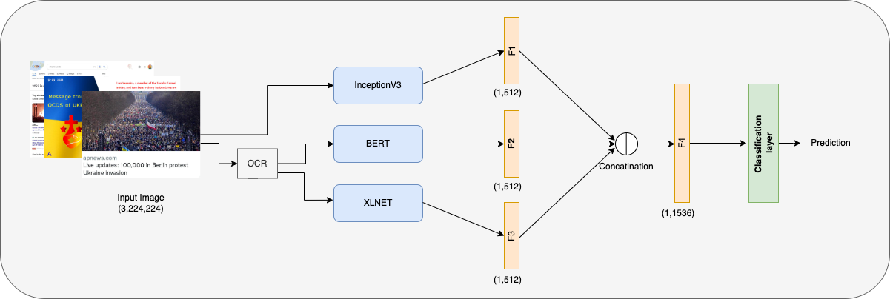
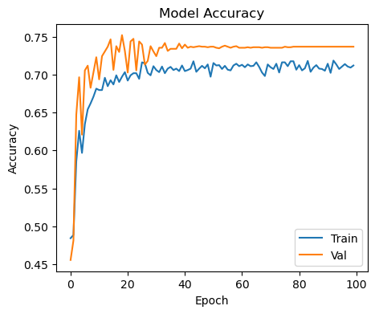
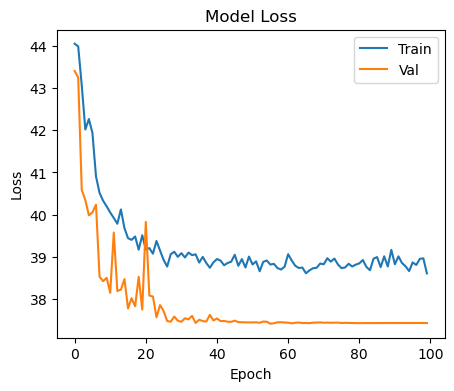

# Multimodal Hate Speech Event Detection Shared Task CASE@RANLP2023

In this repository, we present the implementation of our Multimodal Hate Speech Detection model. To address the challenge of multimodality, we employed an ensemble learning strategy that incorporates both language and image models. Specifically, we used BERT and XLNET for the language model, and InceptionV3 for the image model. Our resulting ensemble model achieves effective results in hate speech detection.
## Ensemble Model

## Graphs

## Authors

- [@Mohammad Kashif](https://github.com/M0hammad-Kashif)
- [@Mohammad Zohair](https://github.com/Zohair0209/)
- [@Saquib Ali](https://github.com/saquibali7/)

